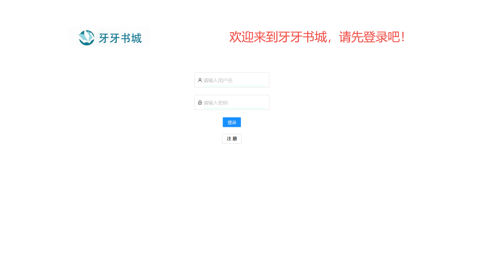
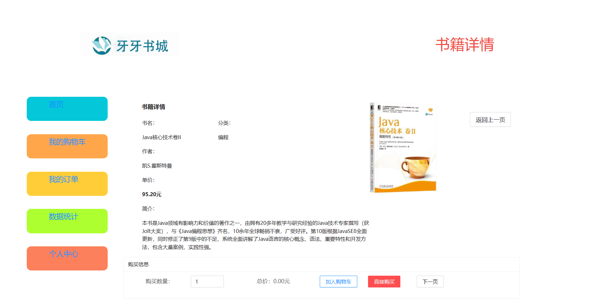
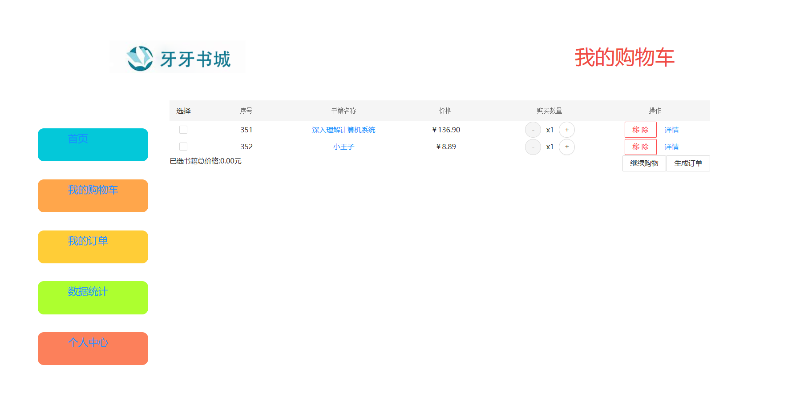
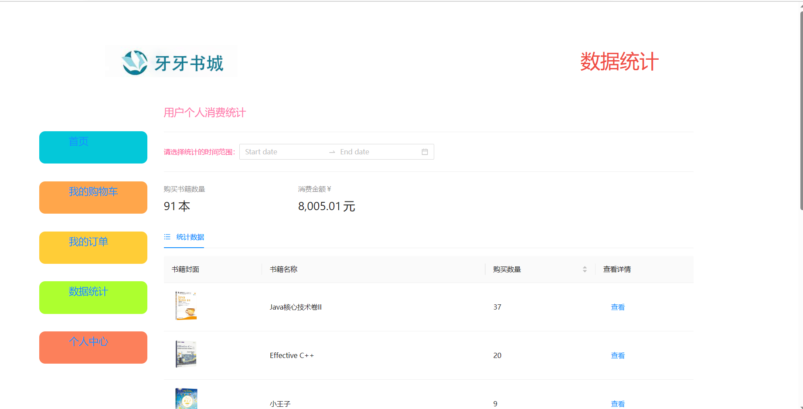
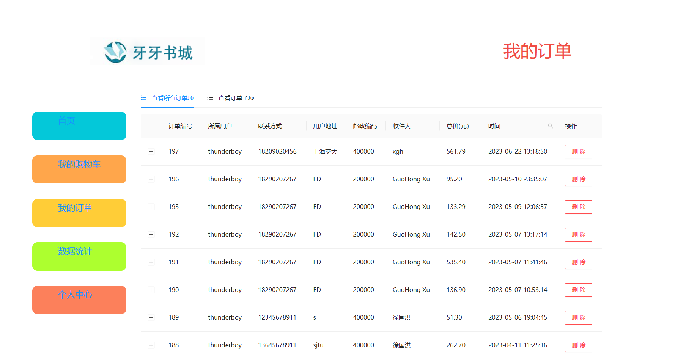
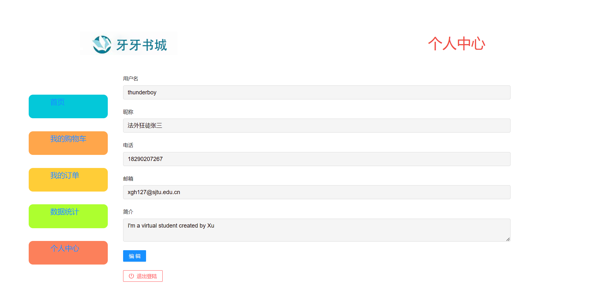

# 线上书城前端项目
### `概述`
这是sjtu-se web课程书城前端代码，css设计参考是扒的一个牙科医院的前端页面，所以应该不会有雷同的前端页面。对于这门课的后来者，我的**建议**是善用老师的demo！自己写会比较累~~~

### `项目运行`

终端： npm start 即可，也可以配置一下，用绿色的三角按钮运行
[http://localhost:3000](http://localhost:3000)

### `运行效果`
- 登录界面

- 首页

- 书籍详情页

- 购物车

- 数据统计

- 订单

- 个人中心

- 管理员界面 略~~，懒得截图咧，请自行探索或者进我主页联系我
### `课程结果`
所有功能全部完成，签到-4.作业-0.5，UserAuth开始没加-1
课程难度比较大，建议及时尽早开始做！同时注意签到的问题！